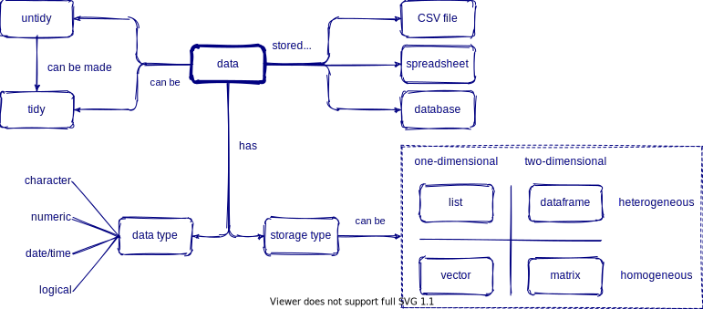

```{r setup, include=FALSE}
options(htmltools.dir.version = FALSE)

library(countdown)
library(knitr)

xaringanExtra::use_xaringan_extra(include = c("tile_view", "share_again", "editable"))
# see here: https://pkg.garrickadenbuie.com/xaringanExtra/#/editable
xaringanExtra::use_extra_styles(hover_code_line = TRUE, mute_unhighlighted_code = TRUE)

```

```{r xaringan-themer, include=FALSE, warning=FALSE}
library(xaringanthemer)
style_mono_accent(base_color = "#23395b",
                  header_font_google = google_font("Roboto Slab"),
                  # fonts: Roboto Condensed, IBM Plex Sans, Amatic SC
                  text_font_google = google_font("IBM Plex Sans", "300", "300i"),
                  code_font_google = google_font("Source Code Pro"),
                  link_color = "#BA8800",
                  #title_slide_text_color = "#022851",
                  code_inline_color = "#BA8800",
                  colors = c(
                    blue = "#6495ed",
                    red = "#f34213",
                    purple = "#3e2f5b",
                    orange = "#ff8811",
                    green = "#136f63",
                    white = "#FFFFFF"))
```

class: center, title-slide
background-image: url("images/flare_helix.png")
background-size: 40%
background-position: 50% 50%

# Data Paths: Pell-Mell or Provenance?


.footnote[*R. Peek, 2020-10-08*]

---
background-image: url("https://reproducibility.stanford.edu/wp-content/uploads/2015/07/email20monster-resized-6001.png")
background-size: 70%
background-position: 60% 70%


## *pell-mell*

 > **(Adverb): confusedly; in an impetuous rush; with indiscriminate violence, energy, or eagerness**

.footnote[ .orange[ [Source: Stanford Center for Reproducible Science](https://reproducibility.stanford.edu/) ]]

 
---
class: left
background-image: url("images/data_provenance_workflow_words.png")
background-position: 50% 90%
background-size: 85%


## *data provenance*

 > Details the origin, changes to, and details supporting the confidence or validity of data. Data provenance is important for tracking down errors within data and attributing them to sources

---
class: center
background-image: url("images/xcl_meltdown.jpg")
background-position: 50% 80%
background-size: 60%

## Managing Workflows (poorly)

### .orange[Excel misuse drops >16k COVID cases]

<br>

.footnote[Source: [@standupmaths](https://twitter.com/standupmaths/status/1313055411285774336?s=21)]


---
class: left
background-image: url("images/ecology_failed_reproducibility.png")
background-position: 100% 50%
background-size: 50%

## Reproducibility Failures

.pull-left[

### .orange[Only 27% of ecology articles made code available to reproduce results]
]

.pull-left[


.footnote[Source: [Culina et al. 2020, PLOS](https://journals.plos.org/plosbiology/article?id=10.1371/journal.pbio.3000763)]

]

---
class: inverse, left
background-image: url("images/lancet_retraction.png")
background-position: 90% 10%
background-size: 60%

### Retractions

.footnote[https://twitter.com/TheLancet/status/1268613313702891523?s=20]

---

### Science {bad} behavior

 > "*The case against science is straightforward: much of the scientific literature, perhaps half, may simply be untrue….We aid and abet the worst behaviors. Our acquiescence to the impact factor fuels an unhealthy competition to win a place in a select few journals…The apparent endemicity of bad research behavior is alarming. In their quest for telling a compelling story, scientists too often sculpt data to fit their preferred theory of the world.*" <br> -Richard Horton (Editor of Lancet)
 
 .footnote[Source: Lancet, DOI: 10.1016/S0140-6736(15)60696-1 ]

---
background-image: url("images/academic_hat.png")
background-position: 95% 10%
background-size: 20%

## What We Teach in Academia

.pull-left[

 ### Write proposals
 ### Collect Data
 ### Get published
 ### Cite and be Cited
]

--

.pull_right[

 <br>
 <br>
 <br>
 ### *Everything else is learn as you go*

]

.pull-left[
 
 .footnote[ *(slide based on great talk by [Richard McElreath](https://youtu.be/zwRdO9_GGhY))*]

]


---

## People think Data Science is...

```{r, echo=FALSE, out.width='85%', fig.align='center'}

knitr::include_graphics("https://media.wired.com/photos/5ca648a330f00e47fd82ae77/master/w_2560%2Cc_limit/Culture_Matrix_Code_corridor.jpg")

```
 

---
class: inverse

## Actual Data Science is this...


```{r echo=F, eval=TRUE, out.width='90%', fig.cap="Illustration by @allison_horst, from Hadley Wickham's talk 'The Joy of Functional Programming (for Data Science)'"}

# these are all from Allison Horst: https://github.com/allisonhorst/stats-illustrations

# CITE AS: "Artwork by @allison_horst"

knitr::include_graphics(path="https://raw.githubusercontent.com/allisonhorst/stats-illustrations/master/rstats-artwork/data_cowboy.png")

```


---
class: inverse, center
background-image: url("images/data-science-wrangle.png")
background-position: 50% 90%
background-size: 50%

## What We Actually Should Learn <br> (*but are rarely taught*)

--

.pull-left[

 ### Organize and Manage Data

 ### Basic Data Wrangling
]

--

.pull-right[

 ### Testing

 ### Reproducibility
]

---
class: inverse
background-image: url("images/datasci_workflow_horst.png")
background-position: 50% 60%
background-size: 90%


### Reproducible Workflows exist!


.footnote[Source: @allison_horst]


---

## Need better conceptual models 

**Data Types**



.footnote[Source: [RStudio](https://github.com/rstudio/concept-maps)]


---
class: inverse

## Many ways to visualize data...

### See 25 ways using same dataset!

 - **https://flowingdata.com/2017/01/24/one-dataset-visualized-25-ways/**


---
class: inverse

## Next up is wrangling...

