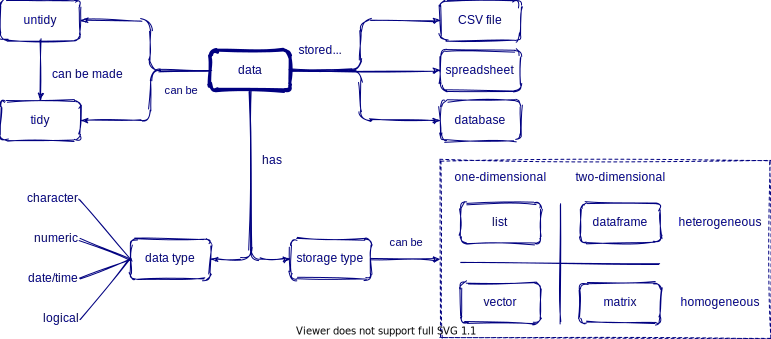

```{r setup, include=FALSE}
options(htmltools.dir.version = FALSE)

library(countdown)
library(here)
library(knitr)

xaringanExtra::use_xaringan_extra(include = c("tile_view", "share_again", "editable"))
# see here: https://pkg.garrickadenbuie.com/xaringanExtra/#/editable
xaringanExtra::use_extra_styles(hover_code_line = TRUE, mute_unhighlighted_code = TRUE)

```

```{r xaringan-themer, include=FALSE, warning=FALSE}
library(xaringanthemer)
style_mono_accent(base_color = "#23395b",
                  header_font_google = google_font("Roboto Slab"),
                  # fonts: Roboto Condensed, IBM Plex Sans, Amatic SC
                  text_font_google = google_font("IBM Plex Sans", "300", "300i"),
                  code_font_google = google_font("Source Code Pro"),
                  link_color = "#BA8800",
                  #title_slide_text_color = "#022851",
                  code_inline_color = "#BA8800",
                  colors = c(
                    blue = "#6495ed",
                    red = "#f34213",
                    purple = "#3e2f5b",
                    orange = "#ff8811",
                    green = "#136f63",
                    white = "#FFFFFF"))
```

class: center, title-slide
background-image: url("../images/flare_helix.png")
background-size: 40%
background-position: 50% 50%

# Data Paths: Pell-Mell or Provenance?

---
background-image: url("https://reproducibility.stanford.edu/wp-content/uploads/2015/07/email20monster-resized-6001.png")
background-size: 70%
background-position: 60% 70%


## pell-mell

 > **(Adverb): confusedly; in an impetuous rush; with indiscriminate violence, energy, or eagerness**

.footnote[ .orange[ [Source: Stanford Center for Reproducible Science](https://reproducibility.stanford.edu/) ]]

 
---
class: inverse
background-image: url("../images/data_provenance.png")
background-position: 50% 80%
background-size: 70%


# Data Provenance

 > Details the origin, changes to, and details supporting the confidence or validity of data. Data provenance is important for tracking down errors within data and attributing them to sources


---
class: inverse
background-image: url("../images/xcl_meltdown.jpg")
background-position: 50% 80%
background-size: 70%

## Managing Workflows (poorly)

### .orange[Excel misuse drops >16k COVID cases]


.footnote[Source: [@standupmaths](https://twitter.com/standupmaths/status/1313055411285774336?s=21)]

---
class: inverse

## What We Teach in Academia

### Write proposals
### Collect Data
### Get published
### Cite and be Cited

### *Everything else is learn as you go*

.footnote[Source: R. McElreath 2020]
---

## What We Actually Should Learn <br> (*but are rarely taught*)

### Organize and Manage Data
### Data Tests
### Reproducibility


---
class: inverse
background-image: url("../images/datasci_workflow_horst.png")
background-position: 50% 60%
background-size: 90%


### Reproducible Workflows: They exist


.footnote[Source: @allison_horst]


---

# Data Types




---
class: inverse

## Many ways to visualize

See this amazing 25 ways to visualize same data!

 - https://flowingdata.com/2017/01/24/one-dataset-visualized-25-ways/


